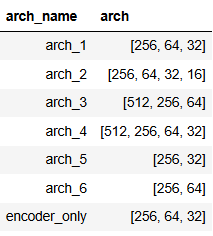

# Project Scivar : Deep learning algorithms for single-cell RNA-seq data clustering

## Introduction

Single-cell sequencing data (scRNA-seq) is a technology for profiling gene expression on a single-cell scale.
profiling gene expression at the single-cell level. To obtain
data, tissue cells are isolated (using microfluidic methods, for example), then lysed to release RNA,
which is then amplified to obtain a sufficient quantity for sequencing.
Each of these sequences includes a barcode
corresponding to the cell of origin. After sequencing and alignment, reads from the same cell are grouped together using the barcode to create a count matrix, 
i.e. a table with genes in rows and cells in columns . Each value in the matrix corresponds to the number of readings of a gene in a
cell. Transcriptomic data from single cell RNA-seq are characterized by a
number of variables (genes) compared to the number of observations (cells), and as such this type of data is subject to a problem known as the “curse of dimensionality”. The high number of variables
makes visualization and, in our case, clustering more complex. Various
approaches exist to deal with this problem, notably by reducing the number of dimensions
by projecting the data into reduced spaces.

The aim of clustering here is to group cells according to their cell type. Once
these clusters have been defined, further study can enable labels (cell type) to be
put on each of the clusters, looking for example at the marker genes
expressed in the clusters. Clustering is an important step in the analysis of scRNA-seq data, which, in the context of personalized medicine, makes it possible to
to precisely characterize a patient's tissues in order to implement a personalized
treatment based on the cellular profiles identified. Traditionally, clustering is performed
on data after dimension reduction by PCA (Principal Component Analysis) using clustering algorithms such as K-means, Louvain or Leiden.

Another way of tackling the problem of data dimensionality is to em- ploy deep learning techniques. Indeed, deep learning is a major advance in artificial intelligence in recent years, which has
has made its mark in a number of fields, with results that are far superior
previous methods, particularly when it comes to representing large-scale data.
the emergence of these methods in transcriptomics. One possibility
is to use an auto-encoder (AE), shown in figure 1, to project data into a
non-linearly reduced space using an encoder, and then reconstructing the input data from the reduced space using a decoder. This is a
unsupervised learning method, as labels are not used in the calculation of the
of the loss function.

Various methods using AEs for clustering scRNA-seq data have already been implemented.
DCA (Deep Count Autoencoder) uses an auto-encoder by
replacing the loss function MSE (Mean Square Error) by a loss function
loss function based on a ZINB (Zero-Inflated Negative Binomial) law, which appears to be a better
to the scRNA-seq data, notably by allowing the imputation of values for the technical zeros of the counting matrix, also known as “dropouts” . Indeed, one
other challenges of scRNA-seq data is the presence of numerous zeros in the
matrix: it's a sparse matrix. However, some of these zeros
have a biological origin and others a technical one. The sequencing method used here is prone to obtaining “false” zeros due to the low sequencing depth per cell.
The method then provides an effective solution for discriminating and imputing values
for these technical zeros.
This method has been repeated using an auto-encoder with the ZINB
but combining clustering with the auto-encoder with a clustering loss function
to optimize clustering while achieving dimension reduction. The scDeepCluster
scDeepCluster method, which added a clustering task on the latent space
space using Kullback-Leibler divergence (KLD) following the Deep Embedding Clustering” (DEC) algorithm.

Other ways of reducing the size of scRNA-seq data while consi-
can be found in the Contrastive-sc method and the scMAE method. Contrastive-sc is no longer an auto-encoder, but an encoder only. This technique is inspired by work carried out on images adapting them for the study of transcriptomic data. For each cell, two different views
are created by applying a dropout that randomly sets the count value of certain genes to zero.
These two different views are given to the same
encoder, and a contrasting dropout function brings the views of the same cell closer together
and move them apart if they come from a different cell. For scMAE, this involves an
auto-encoder associated with a mask. In both cases, clustering is applied a posteriori
on the latent space.
Finally, the scDeepCluster method has itself been taken up by scACE and scziDesk.
The scziDesk method proposes the addition of a third loss function, enabling clustering to be optimized with soft K-means on the latent space. scACE, on the other hand, employs
the Leiden algorithm for cluster initialization, with high resolution to obtain a large number of clusters, while favoring their purity so that certain clusters will be merged
during training.

Thus, the project consists in studying some of these advances, in particular scDeepCluster,
a method with clustering combined with auto-encoder training, and Contrastive-sc,
a method involving clustering a posteriori to training, but also to
evaluate the relevance of these deep learning methods in relation to traditional
methods, in particular by comparing them with PCA. 

## Project structure
The project **Scivar** contains :
- implementation of scDeepCluster and Contrastive-sc
- reproduction of the results of those methods (and the PCA) using the PBMC 4k dataset
- study of hyperparameters for those methods using another dataset (Baron)

The notebooks at the root of the project are cleaned version of the implementation and illustrate the followed approached.

### Articles folder
Contains useful articles papers included scDeepCluster, Contrastive-sc and related works

### Data folder
Contains saved results. So it includeq different experiment results (pdf plots and csv files)

### Dataset folder
Contains the PBMC 10X 4k and the Baron dataset

### model folder
Folder where are saved model weights

### other_notebooks folder
Contains bunch of notebooks not really clean use for experiments or draft

### scDeepCluster folder
Folder created to run the original implementation of scDeepCluster

## Results
If you want to know more about these project and the results, I invite you to read the correspondind paper 
$ BERTHET_Théo_rapport_de_stage.pdf
